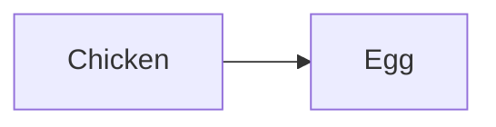


---
# Basic H1:
This is some sample MD to get started.  
There are a number of links, for various places.  
In general, the actual markdown capability depends on the host.

## H2: Links
1. [cheet-sheet](https://www.markdownguide.org/cheat-sheet)
2. Emojis
   - [emojis](https://github.com/markdown-templates/markdown-emojis) :point-right:
   - Github
     - [Github (api)](https://api.github.com/emojis)
     - [Rendered](https://gist.github.com/ricealexander/ae8b8cddc3939d6ba212f953701f53e6)
3. [Mermaid diagrams](https://mermaid.js.org/#/)
4. [Code Block](https://markdown.land/markdown-code-block)
   - [github](https://github.com/github-linguist/linguist/blob/master/lib/linguist/languages.yml#L724)

[Internal Link](#bottom)

## Basic Samples

### Table

|Col1|Col2 |
|--- |---  |
|A   |Table|

**Sample Code**
```csharp
Console.WriteLine("Hello markdown");
```
Or 
> Block quote

Multi line:  
Using 2 trail spaces

- [X] Start work
- [ ] ~~Go home~~
- [ ] Finish check list



^ A foot note

##### bottom
This is the end 